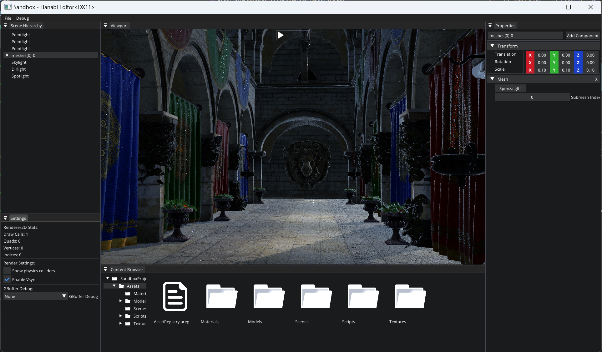

# Hanabi

A simple game engine made for learning rendering APIs, game engine architecture, etc.

[](https://opensource.org/licenses/MIT)
[](https://isocpp.org/)



## Goals

- Cross-platform, multiple graphics API compatible.
- Useable for game development.

## Supported platforms and APIs

|                | DirectX 11               | Vulkan                        | 
| -------------- | ------------------------ | ----------------------------- |
| Windows        | :heavy_check_mark:       | :heavy_multiplication_x:      |
| macOS          | :heavy_multiplication_x: | :heavy_multiplication_x:      |
| Linux          | :heavy_multiplication_x: | :heavy_multiplication_x:      |

## Dependencies

- [glfw](https://github.com/glfw/glfw)
- [ImGuizmo](https://github.com/CedricGuillemet/ImGuizmo)
- [box2d](https://github.com/erincatto/box2d)
- [entt](https://github.com/skypjack/entt)
- [filewatch](https://github.com/ThomasMonkman/filewatch)
- [glm](https://github.com/g-truc/glm/tree/master)
- [ImGui](https://github.com/ocornut/imgui)
- [mono](https://github.com/mono/mono)
- [freetype](https://github.com/freetype/freetype)
- [msdfgen](https://github.com/Chlumsky/msdfgen)
- [msdf-atlas-gen](https://github.com/Chlumsky/msdf-atlas-gen)
- [spdlog](https://github.com/gabime/spdlog)
- [stb_image](https://github.com/nothings/stb/blob/master/stb_image.h)
- [yaml-cpp](https://github.com/jbeder/yaml-cpp)
- [assimp](https://github.com/assimp/assimp)

## [Roadmap](https://trello.com/invite/b/669fa865d55b09e9a3402606/ATTI8bab0a10662b1d2682023d0ef4df1111004102D7/my-trello-board)

## Getting Started

### Windows

Require [Vulkan SDK](https://vulkan.lunarg.com/sdk/home) 1.2(or higher)

Visual Studio 2022 is recommended

<ins>**1. Downloading the repository:**</ins>

```
git clone https://github.com/Sigurd015/Hanabi
git submodule update --init --recursive
```

<ins>**2. Run the [Setup-Windows.bat](Scripts/Setup-Windows.bat)**</ins>

<ins>**3. Open .sln file with Visual Studio**</ins>

## Reference

- [TheCherno](https://www.youtube.com/@TheCherno) [Hazel](https://github.com/TheCherno/Hazel)
